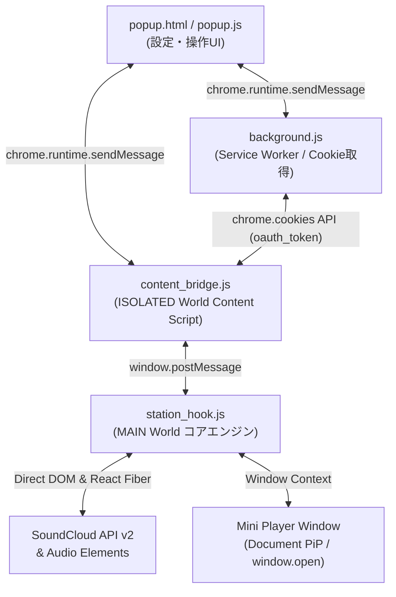

# FreshDig for SoundCloud (SoundCloud Fresh Station & Follower Stream)
## Claude 診断・レビュー用 プロジェクト引き継ぎ仕様書

> **用途**: 本ドキュメントは、Claude等のAIモデルに本プロジェクトのコードレビュー、不具合診断、リファクタリング、機能追加を依頼する際にそのまま共有できる包括的な仕様書・コンテキスト資料です。

---

## 1. プロジェクト概要

- **名称**: FreshDig for SoundCloud - 新アーティスト自動発掘 (SoundCloud Fresh Station)
- **バージョン**: `v1.7.5` (Semantic Versioning)
- **対象プラットフォーム**:
  - Chromium系ブラウザ拡張機能 (Microsoft Edge Add-ons / Chrome Web Store 対応, Manifest V3)
  - ユーザースクリプト版 (Violentmonkey / Tampermonkey 対応: `soundcloud_fresh_station.user.js`)
- **GitHub**: `https://github.com/orangeqoon/soundcloud-fresh-station` (ブランチ: `main`)
- **主要な目的**:
  SoundCloud で音楽を聴く際、**「すでに知っている曲やフォロー済みアーティストの曲を完全自動でスキップし、まだ見ぬ未知のアーティストの新曲だけを途切れず連続再生する」**、あるいは**「フォローしているアーティストのオリジナル新曲だけを聴く（リポスト排除）」**を実現する拡張機能。

---

## 2. コア機能と動作モード

### 2つの動作モード
1. **🔍 DISCOVERY（発掘モード）**:
   - ユーザーの「いいね済み曲（Likes）」、および「フォロー中アーティストの曲」をすべて自動判定して即座にスキップ。
   - Dislike登録した曲・アーティスト・ジャンルも自動スキップ。
   - 完全な「未知のアーティスト」のトラックのみが再生される。
2. **👥 FOLLOWING_NEW（フォロー新曲モード）**:
   - フォローしているアーティストのオリジナル新曲のみを再生。
   - タイムラインを埋め尽くす「リポスト（Repost）」曲を完全検知して自動スキップ。

### 主要機能群
- **浮遊ミニプレイヤー（Picture-in-Picture）**:
  - `documentPictureInPicture` API（対応環境）または別窓ポップアップ（`window.open`）で常駐。
  - アートワーク、曲名、アーティスト名、シークバー、音量バー、操作ボタン（スキップ、いいね、リポスト、フォロー、Dislike、ステーション開始、ワンクリックプレイリスト追加）を完備。
- **ワンクリック・プレイリスト追加**:
  - 気に入った曲を事前に指定した SoundCloud プレイリストへワンクリックで即座に追加。
- **Dislike（除外）リストと双方向連携**:
  - 「この曲を除外」「このアーティストを除外」「このジャンルを除外」のブラックリスト管理。
  - 除外リストを SoundCloud 上の専用プレイリスト（`[FreshStation-Dislikes]`）として書き出し（Export）/ 読み込み（Import）可能。
- **精密な音量・ミュート制御**:
  - 0〜100% の音量スライダーとミュート切替。
  - トラック変更・自動スキップ時も音量設定を記憶・自動復元。

---

## 3. システムアーキテクチャ & ファイル構成

Manifest V3 のセキュリティ制約（サンドボックス分離）を克服するため、以下の多層構造を採用しています。



### 各ファイルの役割
| ファイル名 | 実行コンテキスト | 主な責務 |
| :--- | :--- | :--- |
| `manifest.json` | 拡張機能定義 (MV3) | パーミッション（`storage`, `tabs`, `activeTab`, `cookies`）、ホスト権限、スクリプト宣言 |
| `background.js` | Service Worker | バックグラウンド常駐。`chrome.cookies` から `oauth_token` を抽出して Content Script に供給 |
| `content_bridge.js` | Content Script (ISOLATED) | 拡張機能API（`chrome.storage.local`, `chrome.runtime`）と MAIN world 間の通信ブリッジ |
| `station_hook.js` | Webページ空間 (MAIN) | **最重要ファイル**（約2600行）。Fetch横取り、Audio監視、自動スキップ判定、React連携、MiniPlayer生成 |
| `popup.html` / `popup.js` | ツールバーUI | モード切替、追加先プレイリスト選択、Dislike同期、音量調整、ステータス表示 |
| `soundcloud_fresh_station.user.js` | UserScript | `station_hook.js` を内包した Tampermonkey / Violentmonkey 向け単体スクリプト |

---

## 4. 診断・改修時の重要ルール & 注意点（必読）

### ⚠️ 注意点 1: 全体開発ルール（バージョン番号インクリメント原則）
コードを修正した際は、**必ず以下の全ファイルのバージョン表記を同時にインクリメント（連動更新）すること**：
- `manifest.json`: `"version": "x.y.z"`
- `popup.html`: `<span style="font-size:10px; color:#ff7700; ...">vx.y.z</span>`
- `station_hook.js`: ログ出力 `console.log('[SC-FreshStation] Hook loaded in MAIN world (FreshDig vx.y.z)');`
- `soundcloud_fresh_station.user.js`: UserScript ヘッダー `// @version x.y.z`

> **理由**: ストア提出型拡張機能（Edge Add-ons / Chrome Web Store）では、バージョンを上げないとアップロード時に重複エラーでブロックされるため。

### ⚠️ 注意点 2: ISOLATED World と MAIN World の通信
- v1.7.5 から `content_bridge.js` は popup のメッセージを**全プロパティそのまま**転送するため、プロパティ個別の中継追記は不要になった。
- 代わりに、`station_hook.js` 側で新しい action を追加したら**必ず `ack(...)` で応答を返すこと**（詳細は第6項）。

### ⚠️ 注意点 3: SoundCloud API と DOM 操作のハイブリッド設計
- SoundCloud の API v2（`https://api-v2.soundcloud.com/...`）は非公開仕様（Undocumented）であり、仕様変更や CSRF/トークン失効のリスクがあります。
- そのため、**「DOM上の既存ボタン（Like, Repost, Play, Next）をクリックできる場合はDOMを最優先し、DOMが存在しない場合やバックグラウンド処理時のみ API v2 を呼ぶ」**という二重安全設計にしています。

### ⚠️ 注意点 4: 音量制御とトラック切り替え
- HTML5 オーディオ（`<audio>`）はトラックが切り替わると新しい要素が生成されたり、SoundCloud本体がデフォルト音量（1.0等）で上書きすることがあります。
- そのため、`document.addEventListener('play', ..., true)`（キャプチャフェーズ）と `HTMLMediaElement.prototype.play` フック（DOM外の Audio 要素用）で再生開始を検知し、**保存済みの設定音量（`sc_fresh_station_volume`）**を再適用する。再適用には必ず `getSavedVolume()` を使うこと（再生中要素の音量を読み戻すと SoundCloud のリセットを打ち消せない）。

### ⚠️ 注意点 5: 無限スキップ（全曲スキップ死）の防止
- ブラックリスト判定（DislikeやLikes）でキーの揺らぎ（`undefined`, `null`, 空文字等）が存在すると、全曲が除外対象と誤判定されて曲が高速スキップし続ける事故が起こります。
- `loadCachedData()` で不正なキーを自動クリーンアップするロジックが入っています。
- 連続10曲スキップでブレーキが掛かり、その曲はそのまま再生して次の曲から判定を再開する（v1.7.4 まではブレーキが永久に解除されないバグがあった）。

---

## 5. データの所在と永続化構造（コードから確認済み）

| データ | 保存場所 / キー | 書き込み元 | 備考 |
| :--- | :--- | :--- | :--- |
| Dislike（曲/作者/ジャンル） | MAIN `localStorage` : `sc_fresh_station_data_v1` | `saveDislikeData()` | `{dislikedTracks, dislikedArtists, dislikedGenres, updatedAt}`。キーは数値ID、またはID未解決時 `title_<encoded>` / `artist_<encoded>` |
| 追加先プレイリストID | MAIN `localStorage` : `sc_fresh_station_target_playlist_id` ＋ `chrome.storage.local` : `targetPlaylistId` | `saveTargetPlaylist()` / popup | 二重保存。**ページ読込時は chrome.storage 側が優先で上書き** |
| 再生モード | MAIN `localStorage` : `sc_fresh_station_playback_mode` ＋ `chrome.storage.local` : `playbackMode` | `savePlaybackMode()` / popup | 同上。変更は必ず `savePlaybackMode()` を経由すること |
| 音量 | MAIN `localStorage` : `sc_fresh_station_volume` | `setSoundCloudVolume()` | 0.0〜1.0。未設定なら再適用しない |
| Likes キャッシュ | MAIN `localStorage` : `sc_fresh_station_cache_likes` | `saveCacheData()` | トラックID配列（上限 `MAX_LIKES_SYNC`） |
| フォローキャッシュ | MAIN `localStorage` : `sc_fresh_station_cache_follows` | `saveCacheData()` | ユーザーID配列（上限 `MAX_FOLLOWINGS_SYNC`） |
| プレイリスト一覧キャッシュ | MAIN `localStorage` : `sc_fresh_station_cache_playlists` | `saveCacheData()` | `{id, title, trackCount}` 配列（先頭50件） |
| client_id | MAIN `localStorage` : `sc_fresh_station_client_id` | XHR/fetch フック・`discoverClientId()` | SoundCloud 側の通信やJSアセットから自動取得 |
| OAuth トークン | Cookie `oauth_token` → MAIN `localStorage` : `sc_fresh_station_cache_oauth_token` にキャッシュ | background.js / XHR フック / cookie | `/me` が 401 を返したらキャッシュ破棄＆再要求（v1.7.5〜） |
| Dislike クラウドバックアップ | SoundCloud 上の非公開プレイリスト **`[FreshDig] Disliked Tracks`** | `exportDislikesToPlaylist()` | 数値IDの曲のみ書き出し。読み込み時は名前に `dislike` を含むプレイリストもフォールバック対象 |

- MAIN `localStorage` = soundcloud.com オリジンの localStorage（SoundCloud のページ自身と共有）。UserScript 版は `chrome.storage` を持たないため localStorage のみで動作する。
- `content_bridge.js` が MAIN から `chrome.storage.local` に書き込めるキーは `targetPlaylistId`, `playbackMode` のみ（ホワイトリスト）。

## 6. メッセージプロトコル（v1.7.5〜）

- popup → `chrome.tabs.sendMessage({target:'SC_FRESH_STATION', action, ...})` → `content_bridge.js` が **全プロパティをそのまま** `requestId` 付きで MAIN へ `postMessage` する（プロパティ追加時の中継漏れは起きなくなった）。
- `station_hook.js` は **すべての action に** `requestId` 付きで応答する（`GET_DATA` は `SC_FRESH_STATION_DATA_RESPONSE`、それ以外は `SC_FRESH_STATION_ACTION_RESULT`）。新しい action を追加するときも必ず `ack(...)` を返すこと。応答しないと popup のコールバックが 60 秒タイムアウトまで呼ばれない。
- 両側とも `event.source === window` 以外のメッセージは無視し、`postMessage` の宛先は `window.location.origin` に限定する。

## 7. ビルド

- `soundcloud_fresh_station.user.js` = UserScript ヘッダー（10行）＋ `station_hook.js` 全文。`station_hook.js` を修正したら必ず再生成する。
- `writer.js` は 2026-09-18 時点の**古いコードを埋め込んだ生成スクリプト**。実行すると popup.js / station_hook.js / user.js を旧版で上書きするので実行しないこと。

---

## 8. Claude への相談・診てもらう用プロンプト例

Claudeに相談する際は、以下のテンプレートをコピー＆ペーストして使用してください：

```markdown
以下のSoundCloud用ブラウザ拡張機能「FreshDig for SoundCloud (v1.7.5)」のコードベースを診断・レビューしてください。

【プロジェクト概要】
SoundCloudの再生時、いいね済み曲やフォロー中アーティストを自動判定してスキップし、未知のアーティストのみを発掘・連続再生する拡張機能（Manifest V3 + UserScript）です。
構成:
- background.js (Service Worker, Cookieトークン取得)
- content_bridge.js (ISOLATED Content Script, メッセージ中継)
- station_hook.js (MAIN World コアロジック, 自動スキップ, ミニプレイヤー, 音量制御)
- popup.html / popup.js (設定UI)

【診てほしいポイント（例）】
1. コード全体の保守性・アーキテクチャの改善点（station_hook.js の肥大化や責務分離の提案）
2. 通信や非同期処理のエラーハンドリング、メモリリークのリスク（イベントリスナー解除など）
3. SoundCloudの仕様変更に対する堅牢性
4. ◯◯機能（※追加したい機能や気になる不具合をここに記述）の実装方法

※注意: コード変更を行う際は、manifest.json, popup.html, station_hook.js, soundcloud_fresh_station.user.js の全バージョン表記を連動インクリメントするルールになっています。
```
